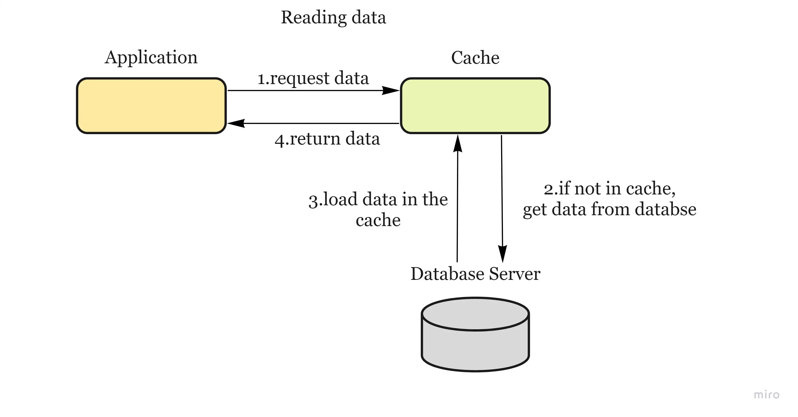

# Caching

\= _temporary storage area that stores the result of expensive responses or frequently accessed data in memory so that subsequent requests are served more quickly._

**When to use it** — when data is read frequently but modified infrequently

**Considerations**:

* Set an **expiration policy** that is not too short (as it reloads data too fast from the database) and not too long (since data can become stale).
* How to keep the cache and database **consistent** (see the _cache invalidation_ section below)
* The cache can easily become a **single point of failure,** you might need to use multiple caches
* Choose an **eviction policy** (see the _cache eviction policies_ section below)
* Think how you handle **concurrency** (aka the reader-writer problem) — When multiple clients are trying to update the cache at the same time, there can be conflicts. A solution would be to use **commit logs**. To update the cache, we can store all the mutations into logs rather than update immediately. And then some background processes will execute all the logs asynchronously. This strategy is commonly adopted in database design.

**Reading from cache:**

<figure><figcaption></figcaption></figure>

## Cache Invalidation

data is modified in the database and becomes inconsistent with the cache

* **Write-aside cache** — data is written into the cache and the corresponding database at the same time (also known as _lazy loading_) — cons: higher latency
* **Write-through cache** — application adds or updates an entry in the cache. Cache synchronously writes entry to the data store. Cache returns the data to the application.
* **Write-around cache** — data is written directly to permanent storage, bypassing the cache — cons: read request for recently written data will create a “cache miss”.
* **Write-back cache** — data is written to cache alone and completion is immediately confirmed to the client and then data is _asynchronously_ updated to the data store — pros: low latency and high throughput; cons: risk of data loss in case of a crash

## Cache eviction policies

* **First In First Out (FIFO)** - evicts the first block accessed first
* **Last In First Out (LIFO)** - evicts the block accessed most recently
* **Least Recently Used (LRU)** - evicts the least recently used items first. When the client requests resource A, it happens as follow:
  * If A exists in the cache, we just return immediately.
  * If not and the cache has extra storage slots, we fetch resource A and return to the client. In addition, insert A into the cache.
  * If the cache is full, we kick out the resource that is least recently used and replace it with resource A.
* **Most Recently Used (MRU)** - evicts the most recently used items first
* **Least Frequently Used (LFU)** - counts how often an item is needed. Those that are used least often are discarded first.
* **Random Replacement (RR)** - randomly evicts a candidate item

## Content Distribution Network (CDN)

\= _system of distributed servers (network) that deliver webpages and other web content to a user based on the geographic locations of the user, the origin of the webpage and a content delivery server._

* a request will first ask the CDN for a piece of static media; the CDN will serve that content if it has it locally available. If it isn’t available, the CDN will query the back-end servers for the file, cache it locally, and serve it to the requesting user.

<figure><figcaption></figcaption></figure>
