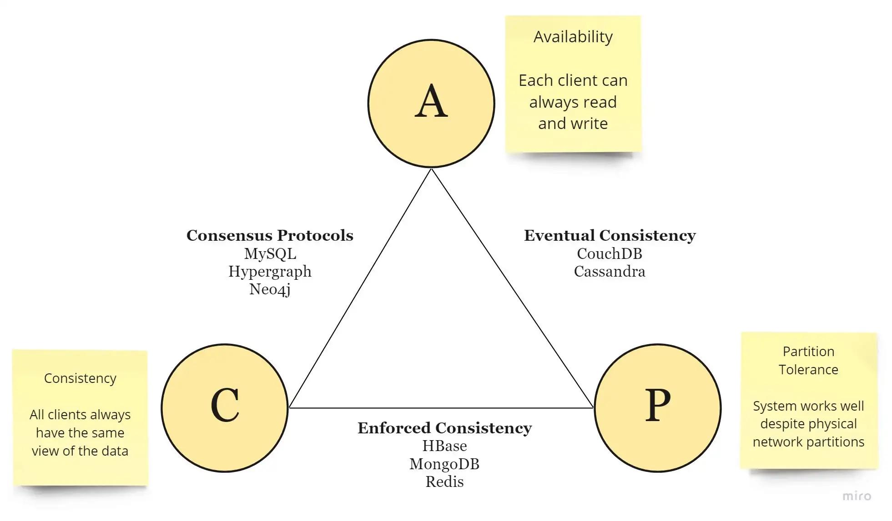

# CAP Theorem

_impossible for a distributed software system to simultaneously provide more than two out of three of the following guarantees (CAP): Consistency, Availability, and Partition tolerance_

* **Consistency**: All nodes see the same data at the same time. Consistency is achieved by updating several nodes before allowing further reads.
* **Availability**: Every request gets a response on success/failure. Availability is achieved by replicating the data across different servers.
* **Partition tolerance:** The system continues to work despite message loss or partial failure. Means that the cluster continues to function even if there is a “partition” (communication break) between two nodes (both nodes are up, but can’t communicate).\

<figure><figcaption></figcaption></figure>

All the combinations available are:

* **CA** — data is consistent between all nodes — as long as all nodes are online — and you can read/write from any node and be sure that the data is the same, but if you ever develop a partition between nodes, the data will be out of sync (and won’t re-sync once the partition is resolved).
* **CP** — data is consistent between all nodes, and maintains partition tolerance (preventing data desync) by becoming unavailable when a node goes down.
* **AP** — nodes remain online even if they can’t communicate with each other and will resync data once the partition is resolved, but you aren’t guaranteed that all nodes will have the same data (either during or after the partition)

* **ACID** (Atomicity, Consistency, Isolation, Durability) databases
  * such as RDBMSs like MySQL, Oracle, and Microsoft SQL Server, chose consistency
  * refuse response if it cannot check with peers
* **BASE** (Basically Available, Soft-state, Eventually consistent) databases
  * such as NoSQL databases like MongoDB, Cassandra, and Redis, chose availability
  * respond with local data without ensuring it is the latest with its peers
