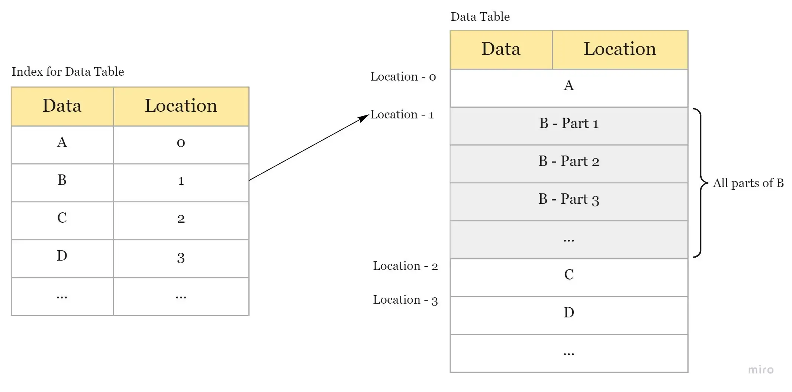

# Databases

## SQL vs NoSQL 

|                            | NoSQL                                                                                                                                                                                                                                                                                                      | SQL                                                                                                                                                                                                                                            |
| -------------------------- | ---------------------------------------------------------------------------------------------------------------------------------------------------------------------------------------------------------------------------------------------------------------------------------------------------------- | ---------------------------------------------------------------------------------------------------------------------------------------------------------------------------------------------------------------------------------------------- |
| When to use                | Storing large volumes of data that often have little to no structure; Cost-saving solution but requires data to be easily spread across multiple servers to scale up; Rapid development - If you’re working on quick iterations of your system which require making frequent updates to the data structure | Need to ensure ACID compliance; Data is structured and unchanging                                                                                                                                                                              |
| Model                      | Non-relational; Stores data in JSON docs, key-value pairs, wide column stores or graphs                                                                                                                                                                                                                    | Relational; Stores data in tables                                                                                                                                                                                                              |
| Data                       | Offers flexibility as not every record need to store the same properties; New properties can be added on the fly; Relationships are often captured by denormalizing data and presenting all data for a single object in a single record; Good for semi-structured, complex or nested data                  | Great for solutions where every record has the same properties; Adding a new property may require altering schemas or backfilling data; Relationships are often captured in a normalized model using joins to resolve references across tables |
| Schema                     | Dynamic or flexible schemas; DB is schema-agnostic and the schema is dictated by the application => agility & highly iterative development                                                                                                                                                                 | Strict schema; Schema must be maintained and kept in sync between app and DB                                                                                                                                                                   |
| Transactions               | ACID support varies                                                                                                                                                                                                                                                                                        | Supports ACID                                                                                                                                                                                                                                  |
| Consistency & Availability | Strong consistency support; CAP can be treated to meet the needs of the app                                                                                                                                                                                                                                | Strong consistency enforced and prioritized over A\&P                                                                                                                                                                                          |
| Performance                | Can be maximized by reducing C; All info about an entity is typically in a single record, so an update can happen in a single operation.                                                                                                                                                                   | Insert & update performance is dependent upon how fast a write is committed. Can be maximised by scaling up available resources.; Info about an entity may be spread across multiple table                                                     |
| Scaling                    | Horizontally                                                                                                                                                                                                                                                                                               | Vertically                                                                                                                                                                                                                                     |

## NoSQL Types 

| Type      | Description                                                                                                                                                                                                                                                                                                                                                                                                                                                                                                                                                                                                                                                                                                                                                                                          |
| --------- | ---------------------------------------------------------------------------------------------------------------------------------------------------------------------------------------------------------------------------------------------------------------------------------------------------------------------------------------------------------------------------------------------------------------------------------------------------------------------------------------------------------------------------------------------------------------------------------------------------------------------------------------------------------------------------------------------------------------------------------------------------------------------------------------------------- |
| Key-Value | Uses a map where each key is associated with one and only one value in a collection. Each key is represented as an arbitrary string (hash value). The value is stored in BLOB. Doesn’t have a query language. They only allow to store, retrieve and update the data using get/put/delete commands e.g. DynamoDB (Nike), Cassandra, Redis, Memcache, Manhattan (Twitter), Sherpa (Yahoo) For: session, shopping cart info                                                                                                                                                                                                                                                                                                                                                                            |
| Document  | Stores data on the basis of key/value which is similar to a key-value db. The only difference is that it stores the values in the form of XML, JSON, BSON. Allows storage for complex data - trees, collections, dictionaries. Doesn’t support relations. Each doc is a standalone. Doesn’t support joins. e.g. MongoDb (eBay), CouchDB (LinkedIn)                                                                                                                                                                                                                                                                                                                                                                                                                                                   |
| Column    | Stores data in column families as rows. Each column family can be compared to a container of rows where the key identifies the row & the row consists of multiple columns. Rows don’t need to have the same columns and columns can be added to any row e.g. Cassandra (Instagram, Walmart), HBase (Salesforce, FB Messages, Imgur notifications)                                                                                                                                                                                                                                                                                                                                                                                                                                                    |
| Graph     | Stores data in the form of nodes and edges where nodes = entities and edges = relationships. Stores data only once & a no. of different types of relationships can be stored in these nodes. Relationships can be uni and bi direcational (as in RDBMS). Adding new relationships is easy but changing existing ones is difficult.. e.g. Neo4J, OrientDB, InfiniteGraph, FlockDB (Twitter), TAO (FB Social Graph)                                                                                                                                                                                                                                                                                                                                                                                    |
| Vector    | 
stores data as high-dimensional vectors, which are mathematical representations of features or attributes. Each vector has a certain number of dimensions, which can range from tens to thousands, depending on the complexity and granularity of the data. The vectors are usually generated by applying some kind of transformation or embedding function to the raw data, such as text, images, audio, video, and others.  pros: fast and accurate similarity search and retrieval of data based on their vector distance or similarity.    <a href="https://weaviate.io/">https://weaviate.io/</a>  <a href="https://www.pinecone.io/">https://www.pinecone.io/</a> 
 |

## Sharding or Data Partitioning

* **Horizontal Partitioning** — put different rows into different tables — **cons**: unbalanced servers (if the value whose range is used for sharding isn’t chosen carefully)
* **Vertical Partitioning** divide our data to store tables related to a specific feature in their own server (instagram use case — user profile information stored on one DB server, friend lists on another) — **cons**: if our application experiences additional growth, then it may be necessary to further partition a feature specific DB across various servers
* **Directory Based Partitioning** — create a lookup service which knows your current partitioning scheme and abstracts it away from the DB access code.

**Partitioning Methods:**

_= process of splitting up a DB/table across multiple machines to improve the manageability, performance, availability, and load balancing of an application_

**Partitioning Criteria:**

* **Key or Hash-based partitioning** — apply a hash function to some key attributes of the entity we are storing — **cons**: adding new servers means changing the hash function which would require redistribution of data and downtime for the service. (use Consistent Hashing)
* **List partitioning** — each partition is assigned a list of values, so whenever we want to insert a new record, we will see which partition contains our key and then store it there
* **Round-robin partitioning** — With ’n’ partitions, the ‘i’ tuple is assigned to partition (i mod n).
* **Composite partitioning** — combine any of the above partitioning schemes to devise a new scheme

**Complexities:**

**Joins and Denormalization** — not feasible to perform joins that span database shards (denormalize the database so that queries that previously required joins can be performed from a single table)

**Referential Integrity** — enforcing foreign keys in a sharded database can be extremely difficult. (not supported by most RDBMS — has to be enforced in application code.)

**Celebrity problem** — how would you deal with hotspots? (one way would be to add a shard for each celebrity)

**Rebalancing/Resharding** — data distribution is not uniform and there is a lot of load on a shard => have to create more DB shards or have to rebalance existing shards.

**Strategies**:

* **Fixed number of partitions** — Create many more partitions than there are nodes, and assign several partitions to each node
* **Dynamic partitioning** — when a partition grows to exceed a configured size, it is split into 2 partitions so that approximately half of the data ends up on each side of the split (no of partitions adapt to the total data volume)
* **Partitioning proportionally to nodes** — have a fixed no of partitions per node. The size of each partition grows proportionally to the dataset size while the no of nodes remains unchanged

Examples of Real World Scenarios:

* [_**Read about Tinder’s Geosharded Recommendations Part 1: Sharding Approach**_](https://medium.com/tinder-engineering/geosharded-recommendations-part-1-sharding-approach-d5d54e0ec77a) _—_ Based on Google’s S2 which uses the **Hilbert curve** (_=a space-filling curve that preserves spatial locality: two points that are close on the Hilbert curve are close in physical space. Each smallest Hilbert curve clone is a cell, and 4 adjacent cells form a bigger cell._) Create the geoshards by enumerating all the possible container sizes, and calculate the standard deviation of each sharding configuration, the one with smallest standard deviation will be the most balanced geo sharding configuration we are looking for.
* [_**Read about Uber’s Unwinding Uber’s Most Efficient Service**_](https://medium.com/@buckhx/unwinding-uber-s-most-efficient-service-406413c5871d) _—_ using a QuadTree — Take a flat projection of your search space and divide it into quarters that we’ll call cells. You then divide each of those cells into quarters recursively until you hit a defined maximum depth which will be the leaves of the tree.
* [_**Read about Instragram’s Sharding & IDs at Instagram**_](https://instagram-engineering.com/sharding-ids-at-instagram-1cf5a71e5a5c)\

## Replication 

_= keeping a copy of the same data on multiple machines that are connected via a network._

**Reasons**:

* **Latency** — Keep data geographically close to your users (reduce access latency)
* High **availability** — Allow the system to continue working even if some parts of it have failed
* **Scalability** — Scale out the number of machines that can serve read queries

**Leader-based replication**:

* One of the replicas is designated as the **leader**. When clients want to write to DB, they send their requests to the leader, which writes the data to its local storage
* The other replicas (**followers**) receive the data from the leader in a process called **replication log** or **change stream**.
* When a client wants to read from the DB, it can query both leader/any of the followers.

## Indexes 

_= data structure that improves the speed of data retrieval operations on a database table at the cost of additional writes and storage space to maintain the index data structure._

Can be created using one or more columns of a database table.

<figure><figcaption></figcaption></figure>
