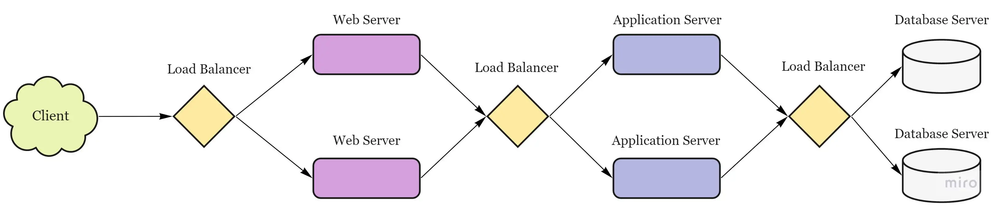

# Load Balancer

* helps to spread the traffic across a cluster of servers to improve responsiveness and availability of applications, websites or databases.

### **Benefits**

* **Improving website performance:** faster, uninterrupted service, less downtime and higher throughput
* predictive analytics that predict traffic bottlenecks (smart LB)
* **Ensuring high availability, reliability and scalability:** fewer failed or stressed components.
* **Health checking:** LBs use the [heartbeat protocol](../system-design-patterns/liveness/heartbeat.md) to monitor the health and, therefore, reliability of end-servers.
* **TLS termination:** LBs reduce the burden on end-servers by handling TLS termination with the client.
* **Reduced human intervention:** Because of LB automation, reduced system administration efforts are required in handling failures.
* **Service discovery:** An advantage of LBs is that the clients’ requests are forwarded to appropriate hosting servers by inquiring about the service registry.
* **Security:** LBs may also improve security by mitigating attacks like denial-of-service (DoS) at different layers of the OSI model (layers 3, 4, and 7).
* **Geographic distribution:** distribute traffic across data centers in different geographic locations. This ensures that users are directed to the nearest or best-performing data center, reducing latency and improving user experience.
*   **Content caching:** can cache static content, such as images and videos.

    <figure><figcaption></figcaption></figure>

### **Algorithms**

* <mark style="color:yellow;">**Round Robin Method**</mark>**:** distributes incoming requests sequentially to available servers in a circular order.
  * **Pros:**
    * Easy to implement and understand.
    * Works well when servers have similar capacities.
  *   **Cons:**

      * May not perform optimally when servers have different capacities or varying workloads.
      * No consideration for server health or response time.

* <mark style="color:yellow;">**Weighted Round Robin Method**</mark>**:** servers with higher weights (= an integer value that indicates the processing capacity) receive new and more connections before those with less weights)
  * to handle servers with different characteristics (e.g. processing power, availability, load)
  * **Pros:**
    * Accounts for different server capacities, balancing load more effectively.&#x20;
    * Simple to understand and implement.&#x20;
  *   **Cons:**

      * Weights must be assigned and maintained manually.&#x20;
      * No consideration for server health or response time.

* <mark style="color:yellow;">**Least Connection Method**</mark>**:** directs traffic to the server with the fewest active connections
  * **Pros:**
    * Adapts to differing server capacities and workloads.
    * Balances load more effectively when dealing with requests that take a variable amount of time to process.
  *   **Cons:**

      * Requires tracking the number of active connections for each server, which can increase complexity.&#x20;
      * May not factor in server response time or health.

* <mark style="color:yellow;">**Weighted Least Connections**</mark>**:** combines the Least Connections and Weighted Round Robin algorithms. It directs incoming requests to the server with the lowest ratio of active connections to assigned weight.
  * **Pros:**
    * Balances load effectively, accounting for both server capacities and active connections.
    * Adapts to varying server workloads and capacities.
  *   **Cons:**

      * Requires tracking active connections and maintaining server weights.
      * May not factor in server response time or health.

* <mark style="color:yellow;">**Least Response Time Method**</mark>**:** directs incoming requests to the server with the lowest response time and the fewest active connections.
  * **Pros:**
    * Accounts for server response times, improving user experience.&#x20;
    * Considers both active connections and response times, providing effective load balancing.&#x20;
  * **Cons:**
    * Requires monitoring and tracking server response times and active connections, adding complexity.&#x20;
    * May not factor in server health or varying capacities.\

* <mark style="color:yellow;">**Least Bandwidth Method**</mark>**:** directs incoming requests to the server currently utilizing the least amount of bandwidth
  * **Pros:**
    * Requires monitoring and tracking server bandwidth usage, adding complexity.
    * May not factor in server health, response times, or active connections.
  * **Cons:**
    * Considers network bandwidth usage, which can be helpful in managing network resources.
    * Can provide effective load balancing when servers have varying bandwidth capacities.\

* <mark style="color:yellow;">**IP Hash**</mark>**:** a hash of the IP address of the client is calculated to redirect the request to a server
  * **Pros:**
    * Maintains session persistence, which can be useful for applications requiring a continuous connection with a specific server.
    * Can distribute load evenly when using a well-designed hash function.
  * **Cons:**
    * May not balance load effectively when dealing with a small number of clients with many requests.
      * No consideration for server health, response time, or varying capacities.\

* <mark style="color:yellow;">**URL Hash**</mark>**:** It may be possible that some services within the application are provided by specific servers only. In that case, a client requesting service from a URL is assigned to a certain cluster or set of servers. The URL hashing algorithm is used in those scenarios

### **Stateful load balancing**

As the name indicates, **stateful load balancing** involves maintaining a state of the sessions established between clients and hosting servers. The stateful LB incorporates state information in its algorithm to perform load balancing.

Essentially, the stateful LBs retain a data structure that maps incoming clients to hosting servers. Stateful LBs increase complexity and limit scalability because session information of all the clients is maintained across all the load balancers. That is, load balancers share their state information with each other to make forwarding decisions.

### **Stateless load balancing**

**Stateless load balancing** maintains no state and is, therefore, faster and lightweight. Stateless LBs use consistent hashing to make forwarding decisions. However, if infrastructure changes (for example, a new application server joining), stateless LBs may not be as resilient as stateful LBs because consistent hashing alone isn’t enough to route a request to the correct application server. Therefore, a local state may still be required along with consistent hashing.\
