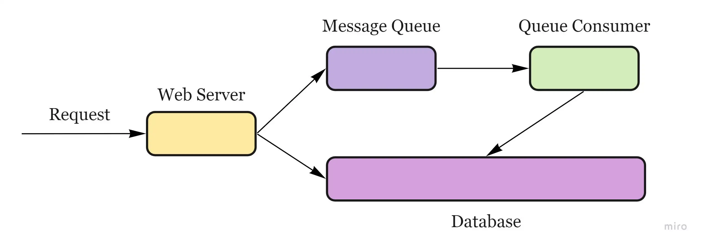

# Message Queues

_= durable component, stored in memory, that supports asynchronous communication. Helps reduce request times for expensive operations that would otherwise be performed in-line. Receives, holds, and delivers messages._

<figure><figcaption></figcaption></figure>

If an operation is too slow to perform inline, you can use a message queue with the following workflow:

* An application publishes a job to the queue, then notifies the user of job status.
* A worker picks up the job from the queue, processes it, then signals the job is complete.

e.g. RabbitMQ, Amazon SQS

__

__
