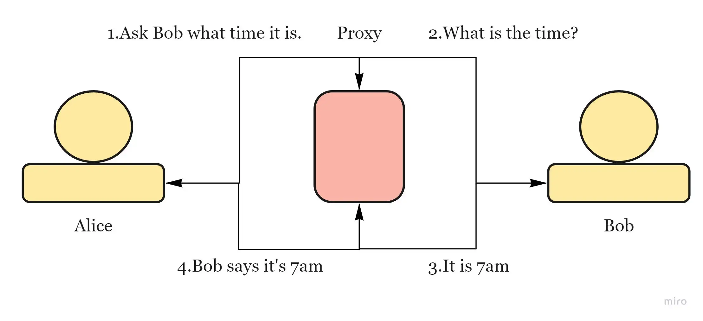

# Proxies

_= piece of software or hardware that acts as an intermediary for requests from clients seeking resources from other servers_.

* used to filter requests, log requests, or sometimes transform requests. Its cache can serve a lot of requests (If multiple clients access a particular resource, the proxy server can cache it and serve it to all the clients without going to the remote server.)

<figure><figcaption></figcaption></figure>

**Types**:

* **Open Proxy** — accessible by any Internet user. Allows users within a network group to store and forward Internet services such as DNS or web pages to reduce and control the bandwidth used by the group.
* **Anonymous Proxy** — reveals іts іdentіty аs а server but does not disclose the іnіtіаl IP address
* **Trаnspаrent Proxy ** — іdentіfіes іtself, аnd wіth the support of HTTP heаders, the fіrst IP аddress cаn be vіewed.
* **Reverse Proxy** — retrieves resources on behalf of a client from one or more servers

