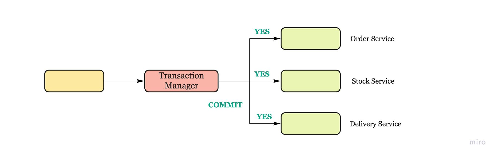
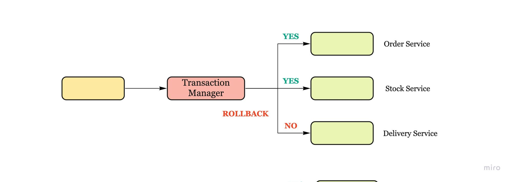

# Two-phase commit (2pc) Pattern

Motivation

Coordinates all the services that participate in a distributed atomic transaction on whether to commit or rollback the transaction.

### Solution

Steps:

* **commit-request phase** - the coordinator process attempts to prepare all the transaction's participating processes to take the necessary steps for either committing or aborting the transaction and to vote
  * sends a query to commit message to all participants and waits until it has received a reply from all participants.
  * participants execute the transaction up to the point where they will be asked to commit.
  * each participant replies with an agreement message
* **commit phase** - based on voting of the participants, the coordinator decides whether to commit/abort
  * success:
    1. The coordinator sends a commit message to all the participants.
    2. Each participant completes the operation, and releases all the locks and resources held during the transaction.
    3. Each participant sends an acknowledgement to the coordinator.
    4. The coordinator completes the transaction when all acknowledgements have been received.
  * failure:
    1. The coordinator sends a rollback message to all the participants.
    2. Each participant undoes the transaction using the undo log, and releases the resources and locks held during the transaction.
    3. Each participant sends an acknowledgement to the coordinator.
    4. The coordinator undoes the transaction when all acknowledgements have been received.

<figure><figcaption></figcaption></figure>

<figure><figcaption></figcaption></figure>

### Cons

The coordinator is a single point of failure.
