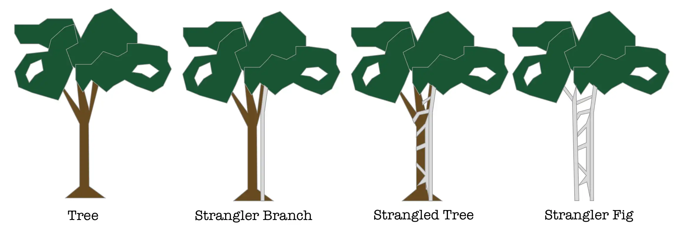
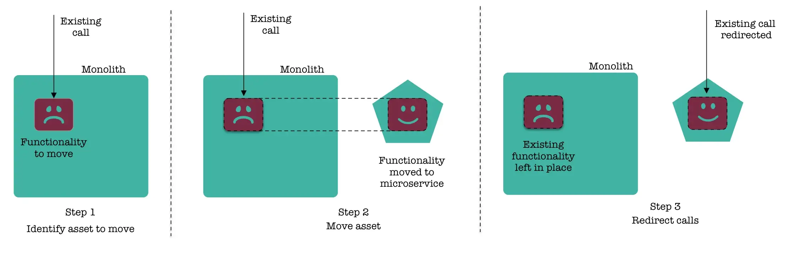
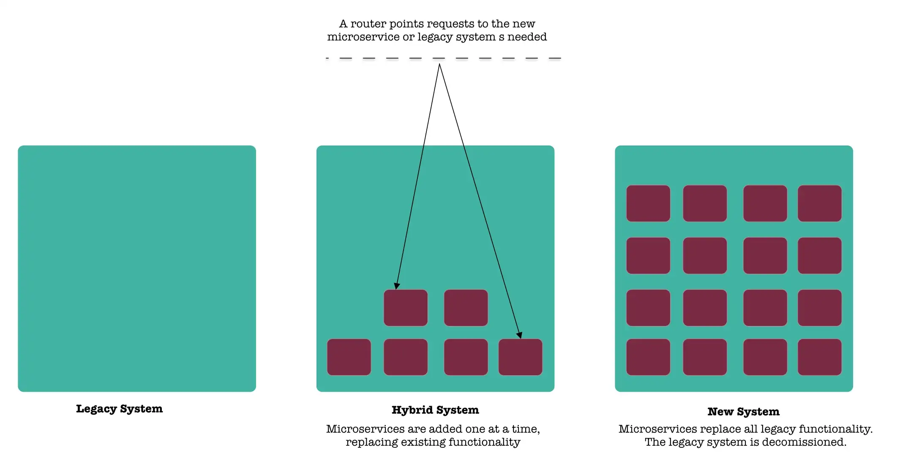

# The Strangler Fig Migration Pattern

A migration technique that has been frequently used when doing system rewrites is called the Strangler Fig Application. This migration method is based on incrementally replacing existing functionalities of the old legacy system with new applications and services in a phased approach until the new application system eventually replaces all of the old legacy system’s features.

The name of this type of tree, the Strangler Fig, comes from their pattern of growth around the host tree, which often results in the host’s death. The roots grow down to the forest floor where they take root and begin to take nutrients from the soil. Gradually the roots wrap around the host tree, widen, and slowly form a lattice-work that surrounds the host’s trunk. The fig’s crown grows foliage which soon overshadows the tree. Eventually, the host tree dies leaving the fig with a hollow trunk.

<figure><figcaption></figcaption></figure>

Martin Fowler chose this as the name of the pattern as a metaphor of describing a way of doing rewrite of an important system. Our new system is initially supported by and wrapping the existing system. The old and the new can co coexist while the new system can grow and potentially replace the entire old system.

> “An alternative route is to gradually create a new system around the edges of the old, letting it grow slowly over several years until the old system is strangled.”
>
> \~ Martin Fowler

### Advantages 

* The pattern will not be suitable for small systems where the complexity and size are low.
* The pattern cannot be used in systems where requests to the back-end system cannot be intercepted and routed.

### When not to use it 

> “The most important reason to consider a strangler application over a cut-over rewrite is reduced risk. A strangler can give value steadily and the frequent releases allow you to monitor its progress more carefully. Many people still don’t consider a strangler since they think it will cost more — I’m not convinced about that. Since you can use shorter release cycles with a strangler you can avoid a lot of the unnecessary features that cut over rewrites often generate.**”**\
> \~ Martin Fowler

* It allows for incremental migration to a new system.
* It allows to pause and even stop the migration while still taking advantage of the new system built so far.
* Each step is reversible, reducing the risk of each incremental step.

### Issues 

* Considerable effort is required for the legacy and new system integrations.
* Considerable effort is required for the parallel run of the same functionality.
* Big commitment. Lack of will and resources to finish the strangling job might lead you into a bigger mess where your system now has two ways of doing everything with an awkward interface between the two.

### How it works

<figure><figcaption></figcaption></figure>

The strangler fig pattern allows you to move functionality over to your new service without having to touch or make changes to your existing system.

The pattern involves 4 steps:

* **Identify** -> identify parts of the existing system that you wish to migrate. (use Domain Driven Design to identify the various bounded contexts)
* **Transform** -> implement this functionality in your new microservice.
* **Co-exist** -> leave the existing module in the legacy application as-is. Incrementally reroute calls from the monolith over to the new microservice.
* **Eliminate** -> once the traffic is completely redirected to the microservice, eliminate the legacy module.

First, add a proxy (facade), which sits between the legacy application and the user. This can be a “bare bones” routing app or an API Gateway. Initially, this proxy doesn’t do anything and all the application traffic is routed to the legacy application. Once a new component is built, you can link it to the proxy and you can allow the proxy to serve traffic to that page. You can also test your new functionality in parallel against the existing monolithic code. Keep adding more services and link them to the proxy. Repeat until all required functionality is handled by the new stack. Both the monolith and the new built component need to be functional for a period of time. Sometimes the transitional phase can last for an extended duration. When the new component has been incrementally developed and tested, the legacy monolithic application can be removed.

<figure><figcaption></figcaption></figure>

### Resources 

* Martin Fowler [Strangler Application](https://www.martinfowler.com/bliki/StranglerApplication.html)
* Michiel Rook [The Strangler pattern in practice](https://www.michielrook.nl/2016/11/strangler-pattern-practice/)
* Azure Cloud Patterns [Strangler pattern](https://docs.microsoft.com/en-us/azure/architecture/patterns/strangler)
