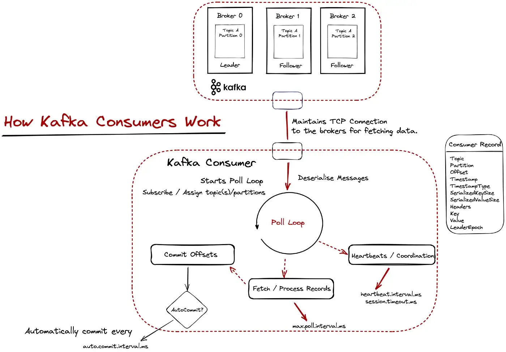

# Design a Distributed Message Queue & Event Streaming Platform

## Designing a Distributed Message Queue with additional features

In modern architecture, systems are broken up into small and independent building blocks with well-defined interfaces between them. Message queues provide communication and coordination for those building blocks.

Advantages:

* decoupling - eliminate tight coupling between components so they can be updated independently
* improved scalability - we can scale consumers/producers independently based on traffic load
* increased availability - if one part of the system goes offline, the other components can continue to interact with the queue
* better performance - make async communication easy - producers can add messages to a queue without waiting for the response and consumers can consume messages whenever they are available

Message queues&#x20;

* e.g. RabbitMQ, RocketMQ, ActiveMQ
* do not have as strong a retention requirement as event streaming platforms; retain messages in memory just long enough for them to be consumed.
* do not maintain message ordering

Event streaming platform - Kafka, Pulsar

###

### Problem&#x20;

Functional requirements:

* Producers sens messages to a queue and consumers consume messages from a queue.
* **format** - text messages only, measured in the range of KBs
* **data delivery semantic** - at-least-once
* **order of delivery** - messages should be consumed in the same order they were produced
* **data retention** - 2 weeks

Non functional requirements:

* high throughput, low-latency, configurable based on use case
* scalable
* persistent and durable

###

### Solution

Components:

* Clients:
  * <mark style="color:yellow;">**Producers**</mark> - pushes messages to specific topics
  * <mark style="color:yellow;">**Consumer Groups**</mark> - subscribes to topics and consumes messages
* Core Service and Storage:
  * <mark style="color:yellow;">**Brokers**</mark> - hold multiple partitions. A partition holds a subset of messages for a topic.
  * Storage:
    * Data storage - messages are persisted in data storage in <mark style="color:yellow;">**partitions**</mark>
      * a partition can be persisted on disk in a <mark style="color:yellow;">**WAL (=write ahead log)**</mark> = just a plain file where new entries are appended to an append-only log
      * each partition can be split into multiple <mark style="color:yellow;">**segments**</mark> - with segments, new messages are appended only to the active segment file. When the active segment reaches a certain size, a new active segment is created to receive new messages, and the currently active segment becomes inactive. Non active segment only serve read requests. Old non active segment files can be truncated if they exceed the retention or capacity limit.
      * <mark style="color:yellow;">**State storage**</mark> stores
        * the mapping between partitions and consumers
        * the last consumed offset of consumer groups for each partition.
      * <mark style="color:yellow;">**Metadata storage**</mark> - persists configuration and properties of topics e.g. no of partitions, retention period, distribution of replicas&#x20;
  * <mark style="color:yellow;">**Coordination Service**</mark>:
    * Service discovery - tracks alive brokers
      * Leader election - one broker is selected as active controller; only one active controller in the cluster - responsible for assigning partitions - e.g. Zookeper, etcd

Producer flow:

1. The producer sends messages to the routing layer.
2. The routing layer reads the replica distribution plan from the metadata storage and caches it locally. When a message arrives, it routes the message to the leader broker replica.
3. The leader broker replica commits the data on disk and lets replicas to sync the message.

Consumer pull model flow:

1. A new consumer wants to join a group 1 and subscribes to topic A
2. The coordinator confirms that the consumer has joined the group and assigns partition 2 to the consumer.
3. Consumer fetches messages from the last consumed offset, which is managed by the state storage.
4. Consumer processes messages and commits the offset to the broker.

<figure><figcaption>
Distributed Message Queue Design
</figcaption></figure>

### How Kafka producers work

Kafka does a lot of things under the hood when the `send()` method is invoked, so let’s outline them below:

1. The message is serialized using the specified serializer.
2. The partitioner determines which partition the message should be routed to.
3. Internally Kafka keeps message buffers; we have one buffer for each partition and each buffer can hold many batches of messages grouped for each partition.
4. Finally, the I/O threads pick up these batches and sent them over to the brokers.\
   At this point, our messages are in-flight from the client to the brokers. The brokers have sent/receive network buffers for the network threads to pick up the messages and hand them over to some IO thread to actually persist them on disk.
5. On the leader broker, the messages are written on disk and sent to the followers for replication. One thing to note here is that the messages are first written on the PageCache and periodically are flushed on disk. (_Note:_ PageCache to disk is an extreme case for message loss, but still you might want to be aware of that)
6. The followers (in-sync replicas) store and sent an acknowledgment back they have replicated the message.
7. A `RecordMetadata` response is sent back to the client.
8. If a failure occurred without receiving an ACK, we check if message retry is enabled; if so, we need to resend it.
9. The client receives the response.

<figure><figcaption></figcaption></figure>

### How Kafka consumers work

Kafka uses a pull-based model for data fetching. At the “heart of the consumer” sits the poll loop. The poll loop is important for two reasons:

1. It is responsible for fetching data (providing **ConsumerRecords**) for the consumer to process and
2. Sends heartbeats and coordinates the consumers so the consumer group knows the available consumers and if a rebalancing needs to take place.

<figure><figcaption></figcaption></figure>

### Resources:

* [System Design Interview – An Insider's Guide: Volume 2 - Alex Xu and Sahn Lam](https://www.amazon.co.uk/System-Design-Interview-Insiders-Guide/dp/1736049119)
* [Daniel Ciocîrlan's Rock the JVM blog post - Optimizing Kafka Clients: A Hands-On Guide](https://blog.rockthejvm.com/optimizing-kafka-clients-a-hands-on-guide/)
